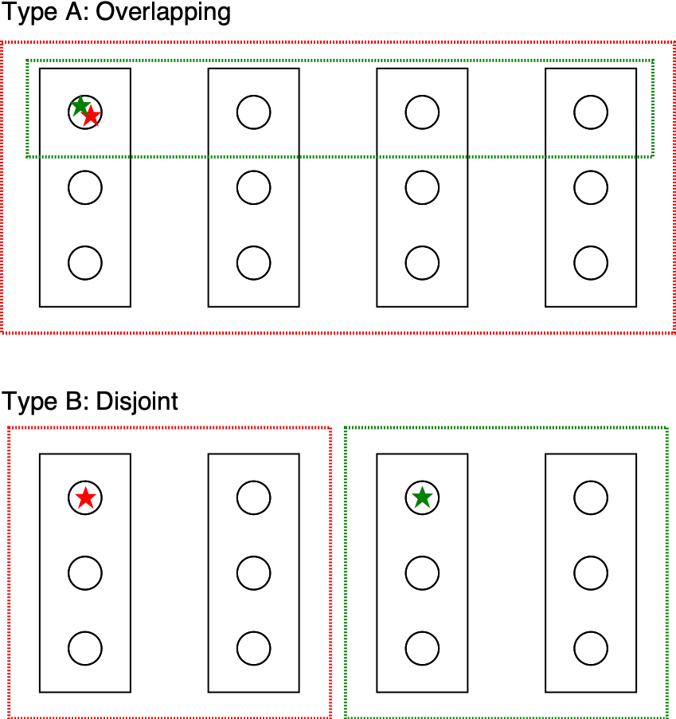

====================
MPI Subcommunicators
====================

ENRICO runs each single-physics driver in a separate subcommunicator.  The single-physics drivers have
several available parallelization schemes (pure MPI, MPI + GPU, and MPI + multicore CPU), and the optimal parallelization
for one driver may be different from the other.  Hence, ENRICO is designed to flexibly construct subcommunicators for
each driver's needs.

-----------------------
Subcommunicator Layouts
-----------------------

Figure :numref:`comm-split-0` illustrates two possible subcommunicator layouts:

    * Type A represents an overlapping layout where the heat-fluids driver is run with 3 ranks per socket and the
      neutronics driver is run with 1 rank per socket.  This might be used if NekRS were run in MPI+GPU mode on a
      machine with 3 GPUs per socket; and OpenMC were run in MPI+OpenMP mode, where each rank spawned threads to
      occupy the cores on each socket.
    * Type B represents a fully disjoint layout.  This might be used if both solvers were run in GPU mode on a machine
      with 3 GPUs per socket; and if the machine did not have sufficient on-node memory to allocate memory for both
      problems on the same nodes

In fact, each driver's subcommunicator can be independently configured with different nodes/driver and ranks/node, thus
enabling many other configurations.

.. _comm-split-0:

    Example subcommunicators layouts.  Black rectangles represent shared-memory domains (nodes or sockets), and black
    circles represent MPI ranks.  The red dashed line represents the heat/fluids subcommunicator, and the green dashed
    line represents the neutronics subcommunicator.  The stars represent the root ranks of the respective subcommunicators.

**No matter how the subcommunicators are configured, the same sequence of MPI communications can be applied.**

